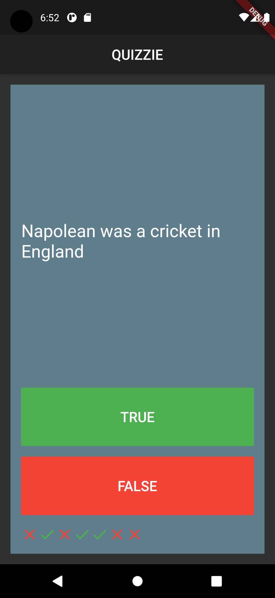

# Quizzie

> Originally inspired by Dr.Angela Yu from Udemy. 
- Using Model and named Constructor 
- Using dart Lists

## Youtube Tutorial
### Youtube: https://youtu.be/mOoAn7CX9Mg

## Visuals

## Follow me 
[Samuelcodes](https://www.instagram.com/samuelcodes)
